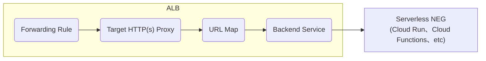

## サマリー

:::message
Cloud RunやCloud FunctionsなどのサーバーレスサービスをApplication Load Balancerから配信する場合、Serverless NEGに紐付けたバックエンドサービスのタイムアウト設定は60分から変更ができないため気を付けましょう。
:::

## はじめに

SREの星野です。Publicationは初投稿です。
タイトルで全てを言い切っているのでこれ以上書くことがないのですが、補足の情報を本文に書いていきます。
また、すでにネット上にこの情報を取り上げた記事がありますが、自身の備忘録を兼ねて投稿します。

## サーバレスサービスを配信する際のネットワーク構成のおさらい

Cloud RunやCloud FunctionsをGlobal、Region、External、Internal問わず、Application Load Balancerから配信する場合Serveless NEGとバックエンドサービスの作成が必要になります。
Serveless NEGはNetwork Endpoint Groupの一種で名前の通りServerlessサービスが対象です。
他のNEGはZonal NEGとInternet NEGがあります。
Zonal NEGはGCEやGKE Podsが対象で、Internet NEGはGCP外のサーバーが対象ですがこの記事では触れません。
Zonal NEGとServerles NEGはGoogle Cloud Japanブログに詳細な解説がありますのでそちらも合わせてご覧ください。
https://medium.com/google-cloud-jp/neg-とは何か-cc1e2bbc979e
https://medium.com/google-cloud-jp/serverless-neg-でシステム開発をより柔軟に-4f9cebd2780f

## 公式ドキュメントは言っている

> [バックエンド サービスのタイムアウト設定](https://cloud.google.com/load-balancing/docs/backend-service?hl=ja#timeout-setting)は、サーバーレス NEG バックエンドを使用するバックエンド サービスには適用されません。バックエンド サービスの `resource.timeoutSec` プロパティを変更しようとすると、次のエラーが発生します。`Timeout sec is not supported for a backend service with Serverless network endpoint groups`
> サーバーレス NEG バックエンドを使用するバックエンド サービスの場合、デフォルトのタイムアウトは 60 分です。このタイムアウトは構成できません。アプリケーションで長時間の接続が必要な場合は、失敗時にリクエストを再試行するようにクライアントを構成します。

https://cloud.google.com/load-balancing/docs/negs/serverless-neg-concepts?hl=ja

Zonal NEGの場合はタイムアウト設定ができるのでServerless NEGでも同じように設定できるかと思いましたができませんでした。
自身の場合は、TerraformでServerless NEGを作成したため、Terraform Stateにtimeout_secがデフォルトの30と表示されていたにもかかわらず、実際のリクエストは30秒を超えてもタイムアウトしなかったため調べたところ前述の仕様に気づきました。

### コンソールの表示

何食わぬ顔で`30 seconds`と表示されていますが実際は`60 minutes`です。

## まとめ

Cloud RunとALBを組み合わせるときは必ずに必要になるこの構成ですが、
この挙動を知らないとハマりがちなので気を付けましょう。

## 参考リンク

https://speakerdeck.com/dena_tech/techcon2023-session5
